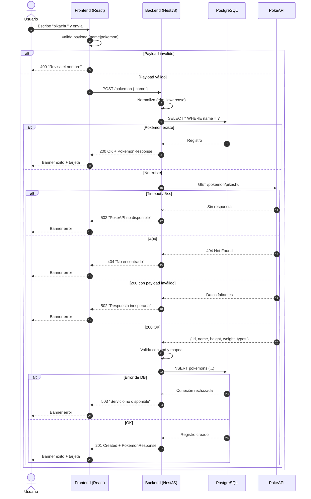
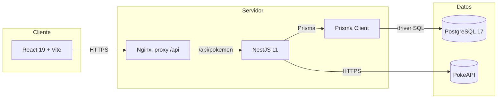
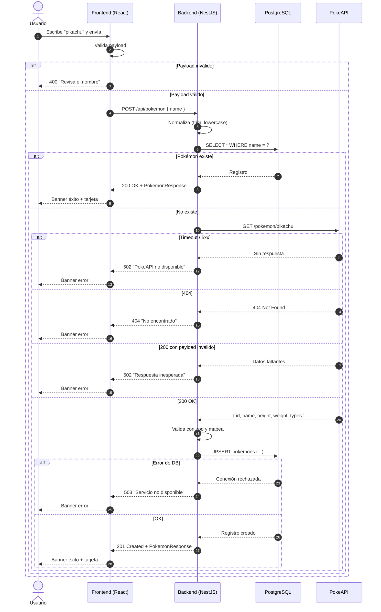

# PLAN — DIAGRAM

## 1. Objetivo
Ilustrar la solución implementada con un diagrama de secuencia Mermaid que cubra el camino feliz, el caso de duplicado, las fallas de PokeAPI, los datos faltantes y las fallas de PostgreSQL.

## 2. Decisiones

| Aspecto | Decisión |
| --- | --- |
| Tipo | Diagrama de secuencia (preferencia del enunciado) |
| Formato | Mermaid (texto versionado en `docs/diagrams/sequence.mmd`) |
| Herramienta | Mermaid renderizado por GitHub Markdown |
| Ubicación | `docs/DIAGRAM.md` (vista) + `docs/diagrams/sequence.mmd` (fuente) |

## 3. Diagrama principal (`docs/diagrams/sequence.mmd`)

## 4. Diagrama de arquitectura (complementario)

`docs/diagrams/architecture.mmd`:

> **Nota de corrección:** la conexión real es `NestJS → Prisma → PostgreSQL`. La conexión directa `NestJS → PostgreSQL` (sin Prisma) del diagrama anterior era incorrecta y queda eliminada.

## 5. Renderizado en `docs/DIAGRAM.md`

El archivo `DIAGRAM.md` incrusta los bloques Mermaid directamente (no usa `include` ni referencias a archivos externos, ya que GitHub no resuelve esas rutas). Los archivos `docs/diagrams/*.mmd` se mantienen como fuente versionada.

## 6. Criterios de aceptación

- [ ] `docs/DIAGRAM.md` muestra ambos diagramas renderizados en GitHub.
- [ ] La secuencia cubre éxito (201), duplicado (200), 404, timeout, payload inválido y fallo de DB.
- [ ] El diagrama de arquitectura muestra los 3 servicios y la red entre ellos sin conexiones duplicadas.
- [ ] Sin dependencia de herramientas externas (solo Mermaid).
- [ ] Los archivos `docs/diagrams/*.mmd` se mantienen como fuente.

## 7. Entregables

- `docs/DIAGRAM.md` (vista renderizada con Mermaid embebido).
- `docs/diagrams/sequence.mmd` (fuente).
- `docs/diagrams/architecture.mmd` (fuente).
