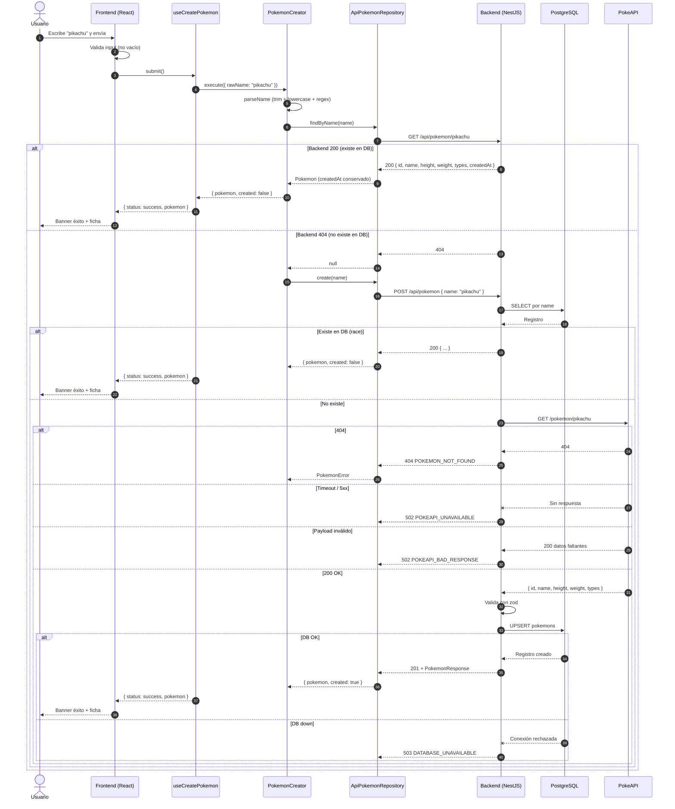
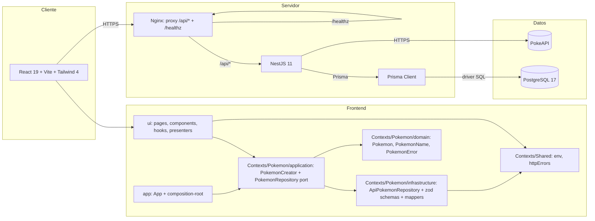

# DIAGRAM — implementación

## 1. Objetivo

Ilustrar la solución construida con un diagrama de secuencia Mermaid
que cubra el camino feliz, el caso de duplicado, las fallas de
PokeAPI, los datos faltantes y las fallas de PostgreSQL, más un
diagrama de arquitectura por capas (incluye frontend contextual).

## 2. Decisiones

| Aspecto     | Decisión                                                                             |
| ----------- | ------------------------------------------------------------------------------------ |
| Tipo        | Diagrama de secuencia + diagrama de arquitectura (flowchart)                         |
| Formato     | Mermaid embebido en este documento (GitHub renderiza directo)                        |
| Herramienta | Mermaid renderizado por GitHub Markdown                                              |
| Ubicación   | `docs/DIAGRAM.md` (vista); fuente versionada en `docs/diagrams/*.mmd` cuando se cree |

> El plan original preveía archivos fuente en `docs/diagrams/`. La
> implementación actual mantiene los bloques Mermaid dentro de
> `DIAGRAM.md` para evitar referencias que GitHub no resuelve. Cuando
> se introduzcan nuevos diagramas, se añadirá su `.mmd` aparte.

## 3. Flujo implementado

Notas del flujo:

- El frontend hace `GET /api/pokemon/:name` antes del `POST` para
  evitar invocaciones innecesarias cuando el Pokémon ya está
  persistido (decisión registrada en ADR `0010`).
- El backend puede responder `200` o `201` al `POST`; el frontend
  interpreta `200` como duplicado y `201` como creación.
- El `AbortController` del hook descarta resultados tardíos pero
  **no** se inyecta en el adaptador HTTP (ADR `0010`).
- La respuesta de éxito se valida contra el schema PokeAPI
  (`types: [{ slot, type: { name, url } }]`); `createdAt` se
  extrae por separado y se tolera ausente.

## 4. Arquitectura por capas

Notas:

- El frontend sigue el patrón `ui → application → port ←
infrastructure → domain` por bounded context
  (`Contexts/Pokemon`, `Contexts/Shared`).
- `PokemonRepository` es el puerto; `ApiPokemonRepository` es el
  adaptador HTTP. Los tests usan `InMemoryPokemonRepository`.
- El composition root (`src/app/composition-root.ts`) ensambla
  `ApiPokemonRepository` + `PokemonCreator` y los inyecta en
  `HomePage`.
- Nginx proxifica cualquier `/api/*` (no solo `/api/pokemon`); ver
  ADR `0004`.

## 5. Criterios de aceptación

- [ ] `docs/DIAGRAM.md` muestra ambos diagramas renderizados en
      GitHub.
- [ ] La secuencia cubre `GET /api/pokemon/:name` previo al `POST`,
      éxito (201), duplicado (200), 404, timeout, payload inválido
      y fallo de DB.
- [ ] El diagrama de arquitectura muestra las capas del frontend
      (`ui` / `application` / `infrastructure` / `domain`),
      `Contexts/Shared`, Nginx, Nest, Prisma, PostgreSQL y PokeAPI,
      sin conexiones duplicadas.
- [ ] Sin dependencia de herramientas externas (solo Mermaid).
- [ ] Los archivos `docs/diagrams/*.mmd` se mantienen como fuente
      cuando se generen.

## 6. Entregables

- `docs/DIAGRAM.md` (vista renderizada con Mermaid embebido).
- `docs/diagrams/sequence.mmd` y `docs/diagrams/architecture.mmd`
  como fuente (a crear cuando se versionen aparte).
