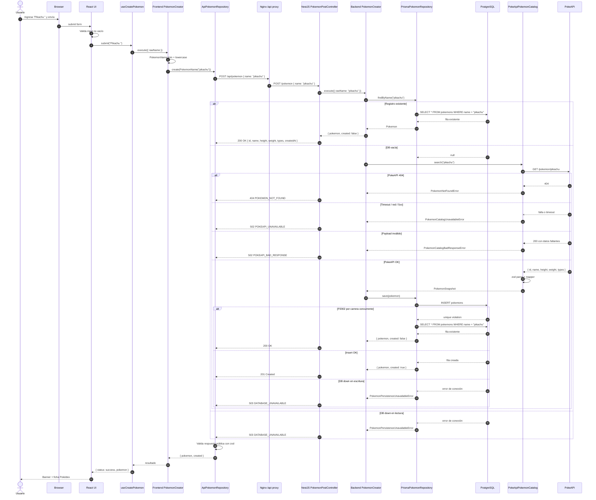

# DIAGRAM — solución implementada

## Objetivo

Mostrar la solución final con Mermaid embebido para GitHub y mantener
las fuentes `.mmd` versionadas en `docs/diagrams/`.

## Decisiones

| Aspecto  | Decisión                                                                                |
| -------- | --------------------------------------------------------------------------------------- |
| Tipo     | Diagrama de secuencia + diagrama de arquitectura                                        |
| Formato  | Mermaid embebido en este documento                                                      |
| Fuente   | `docs/diagrams/sequence.mmd`, `docs/diagrams/architecture.mmd`                          |
| Contrato | Frontend solo envía `POST /api/pokemon`; backend expone `POST /pokemon` y `GET /health` |

## Secuencia

Notas:

- El frontend no hace `GET` previo. Duplicados se resuelven en backend.
- `POST /pokemon` retorna `201` si crea y `200` si ya existía.
- Respuesta pública exitosa: `{ id, name, height, weight, types, createdAt }`.
- `types` es `string[]`; el shape de PokeAPI nunca sale al cliente.
- El hook descarta respuestas tardías; el timeout del request vive en el adaptador HTTP.

## Arquitectura

```mermaid
flowchart LR
    subgraph Client[Cliente]
        Browser[Browser]
    end

    subgraph Frontend[Frontend React 19]
        UI["ui: HomePage, Form, Banner, Result, Presenter"]
        Hook["useCreatePokemon + state discriminado"]
        AppRoot["app: composition-root"]
        FEApp["application: PokemonCreator + PokemonRepository port"]
        FEDomain["domain: Pokemon, PokemonName, PokemonError"]
        FEInfra["infrastructure/api: ApiPokemonRepository, schemas, mappers"]
        FEShared["Shared: env + httpErrors"]
    end

    subgraph Runtime[Docker Runtime]
        Nginx["Nginx frontend container\n/api/* proxy + /healthz"]
        BEContainer["Backend container\nNode 24 Alpine"]
        DBInit["db-init\nprisma db push"]
    end

    subgraph Backend[Backend NestJS 11]
        Nest["Nest app + ValidationPipe + Swagger"]
        Controller["PokemonPostController"]
        BEApp["application: PokemonCreator + errors"]
        BEDomain["domain: Pokemon, value objects, repository port"]
        BEPoke["pokeapi adapter: PokeApiPokemonCatalog"]
        BERepo["prisma adapter: PrismaPokemonRepository"]
        BEShared["Shared: HttpErrorFilter + PrismaService"]
        Health["health: HealthController + DatabaseHealthIndicator"]
    end

    subgraph External[Datos externos]
        Postgres[(PostgreSQL 17)]
        PokeAPI[(PokeAPI)]
    end

    Browser --> UI
    UI --> Hook
    UI --> AppRoot
    AppRoot --> FEApp
    Hook --> FEApp
    FEApp --> FEDomain
    FEApp --> FEInfra
    FEInfra --> FEDomain
    FEInfra --> FEShared
    FEInfra -- "POST /api/pokemon" --> Nginx
    Nginx -- "POST /pokemon" --> BEContainer
    BEContainer --> Nest
    Nest --> Controller
    Nest --> Health
    Controller --> BEApp
    BEApp --> BEDomain
    BEApp --> BEPoke
    BEApp --> BERepo
    BEPoke -- HTTPS --> PokeAPI
    BERepo --> BEShared
    BERepo -- SQL --> Postgres
    Health --> BEShared
    BEShared -- "SELECT 1" --> Postgres
    DBInit -- "prisma db push" --> Postgres
```

Notas:

- Frontend y backend usan bounded contexts, pero el frontend tiene composition root manual.
- Backend usa DI de Nest con tokens `Symbol` para puertos `POKEMON_REPOSITORY`, `POKEMON_CATALOG`, `POKEMON_CREATOR`.
- `db-init` es responsable de preparar schema antes de arrancar backend.
- Backend runtime no ejecuta `prisma db push`; solo arranca `node dist/main.js`.
- Nginx sirve assets estáticos, expone `/healthz` y proxifica `/api/*`.

## Criterios De Aceptación

- [x] Mermaid embebido renderizable por GitHub.
- [x] Fuentes `.mmd` versionadas en `docs/diagrams/`.
- [x] Secuencia cubre `201`, `200`, `404`, `502`, `503`, payload inválido y `P2002`.
- [x] Arquitectura muestra frontend, backend, Nginx, Prisma/PostgreSQL, PokeAPI y health checks.
- [x] No depende de herramientas externas fuera de Mermaid.
