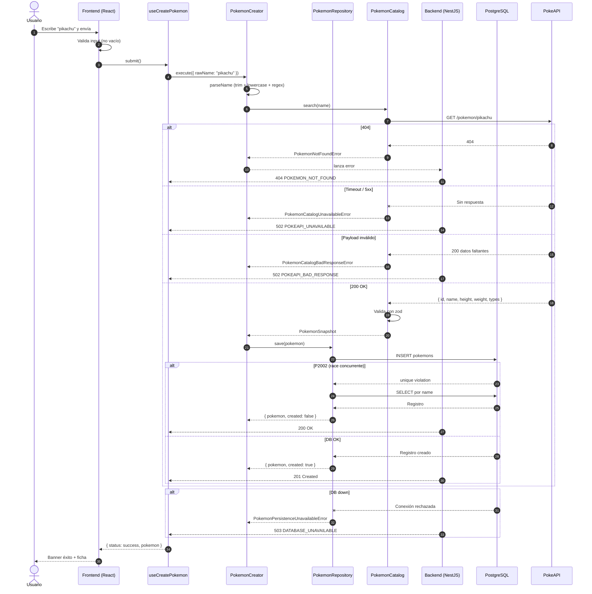
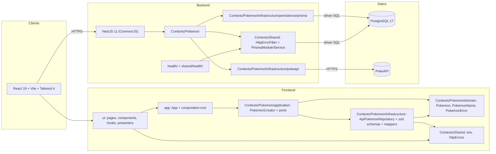

# DIAGRAM — implementación

## 1. Objetivo

Ilustrar la solución construida con un diagrama de secuencia Mermaid
que cubra el camino feliz, el caso de duplicado, las fallas de
PokeAPI, los datos faltantes y las fallas de PostgreSQL, más un
diagrama de arquitectura por capas (incluye frontend y backend
contextuales).

> Alineado con la implementación real (ver ADR `0011`).

## 2. Decisiones

| Aspecto     | Decisión                                                                             |
| ----------- | ------------------------------------------------------------------------------------ |
| Tipo        | Diagrama de secuencia + diagrama de arquitectura (flowchart)                         |
| Formato     | Mermaid embebido en este documento (GitHub renderiza directo)                        |
| Herramienta | Mermaid renderizado por GitHub Markdown                                              |
| Ubicación   | `docs/DIAGRAM.md` (vista); fuente versionada en `docs/diagrams/*.mmd` cuando se cree |

> El plan original preveía archivos fuente en `docs/diagrams/`. La
> implementación actual mantiene los bloques Mermaid dentro de
> `DIAGRAM.md` para evitar referencias que GitHub no resuelve.
> Cuando se introduzcan nuevos diagramas, se añadirá su `.mmd`
> aparte.

## 3. Flujo implementado

Notas del flujo:

- El frontend envía **solo** `POST /api/pokemon`. No hace `GET`
  previo; los duplicados los resuelve el backend con `P2002`
  recovery (ADR `0011`).
- El backend responde `201` o `200` al `POST`; el frontend
  interpreta `200` como duplicado y `201` como creación.
- El `AbortController` del hook descarta resultados tardíos pero
  **no** se inyecta en el adaptador HTTP (ADR `0010`).
- `HttpErrorFilter` traduce cada subclase de error a un
  `ErrorResponse` uniforme; los detalles internos quedan solo en
  los logs con `requestId`.

## 4. Arquitectura por capas

Notas:

- El frontend sigue el patrón `ui → application → port ←
infrastructure → domain` por bounded context
  (`Contexts/Pokemon`, `Contexts/Shared`).
- El backend replica la idea con sus propias capas
  (`Contexts/Pokemon/{domain,application,infrastructure}`,
  `Contexts/Shared`); el `HttpErrorFilter` vive en
  `Contexts/Shared/infrastructure/http` y los errores de
  aplicación en `Contexts/Pokemon/application/errors`.
- `PokemonRepository` y `PokemonCatalog` son los puertos del
  backend. `PrismaPokemonRepository` y `PokeApiPokemonCatalog`
  son los adaptadores. Los tests unitarios sustituyen los
  puertos por dobles; los de integración sustituyen los tokens
  `POKEMON_REPOSITORY` y `POKEMON_CATALOG` (símbolos exportados
  por `PokemonTokens.ts`).
- `src/health/` y `src/shared/health/` quedan fuera de
  `Contexts/` y se muestran como subgrafo propio. El
  `DatabaseHealthIndicator` se inyecta en `HealthController`
  desde `src/shared/health/` y depende de
  `Contexts/Shared/infrastructure/persistence/prisma/PrismaService`.
- El composition root del frontend (`src/app/composition-root.ts`)
  ensambla `ApiPokemonRepository` + `PokemonCreator` y los
  inyecta en `HomePage`.
- Nginx proxifica cualquier `/api/*` (no solo `/api/pokemon`);
  ver ADR `0004`.

## 5. Criterios de aceptación

- [ ] `docs/DIAGRAM.md` muestra ambos diagramas renderizados en
      GitHub.
- [ ] La secuencia cubre éxito (201), duplicado (200), 404,
      timeout, payload inválido, conflicto de unicidad (`P2002`)
      y fallo de DB. La secuencia parte del `POST /pokemon`
      enviado por el frontend (sin `GET` previo).
- [ ] El diagrama de arquitectura muestra las capas del
      frontend (`ui` / `application` / `infrastructure` /
      `domain`), `Contexts/Shared`, las capas del backend
      (`Contexts/Pokemon/{domain,application,infrastructure}` +
      `Contexts/Shared`), `src/health/`, `src/shared/health/`,
      Prisma, PostgreSQL y PokeAPI, sin conexiones duplicadas.
- [ ] Sin dependencia de herramientas externas (solo Mermaid).
- [ ] Los archivos `docs/diagrams/*.mmd` se mantienen como
      fuente cuando se generen.

## 6. Entregables

- `docs/DIAGRAM.md` (vista renderizada con Mermaid embebido).
- `docs/diagrams/sequence.mmd` y `docs/diagrams/architecture.mmd`
  como fuente (a crear cuando se versionen aparte).
